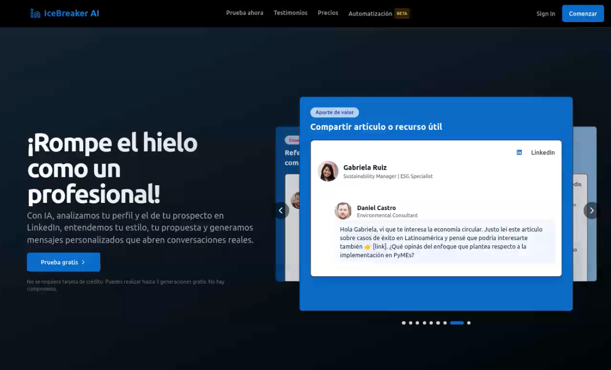

# Introduction

This is a fullstack application designed to create personalized **cold messages** to send to a LinkedIn profile, tailored to your specific goal. Read the [Design document](./docs/design-document.md) for more information about the project.

> **Note**: This project was created as part of a technical challenge for a job interview. The goal is to demonstrate my skills in fullstack web development, including the use of modern technologies and best development practices.


# Demo

## Demo page

You can see the demo page of the project at:

[https://linkedin-icebreaker-messages.vercel.app/](https://linkedin-icebreaker-messages.vercel.app/)

## Demo Video

Watch the demo video to see the project in action:

[](https://youtu.be/SHrLnwxIwXE)

Click on image or [here](https://youtu.be/SHrLnwxIwXE)

## Read more

You can read more about the project in the following articles:

- [Design document](./docs/design-document.md)

# Run project

## [Optional] Use devcontainer

To use a dev container with Visual Studio Code, follow these steps:

1. **Install the Dev Containers Extension:**

 Ensure you have the "Dev Containers" extension installed in Visual Studio Code. You can find it in the Extensions Marketplace.

2. **Open the Project in a Dev Container:**

- If your project includes a .devcontainer folder with the necessary configuration files (like devcontainer.json), Visual Studio Code will prompt you to reopen the project in the container.

- If not prompted, open the Command Palette (Ctrl+Shift+P or Cmd+Shift+P on macOS) and select Dev Containers: Reopen in Container.


3. **Build and Start the Container:**

Visual Studio Code will build the container based on the configuration in the .devcontainer folder. This may include installing dependencies, setting up the environment, and configuring tools like tsc for TypeScript development.

Once the container is running, your project will be fully isolated and ready to use.


## Configuring Environment Variables

Use file `server/.env.example` to create your own `.env` file. You can copy the example file and rename it to `.env`

Is important setup APIs keys in `.env` file


## Run Server

1. Go to path `/server` 

2. install dependencies

```bash
npm install
```
3. run server

```bash
npm run express-api:dev
```
Server will run on port 3001 by default. You can change the port in the `.env` file.


## Run Client

1. Go to path `/client2`

2. install dependencies

```bash
npm install --legacy-peer-deps
```

3. run client

```bash
npm run dev
```

Client will run on port 3000 by default. You can change the port in the `.env` file.

4. Open your browser and go to `http://localhost:3000` to see the application in action.