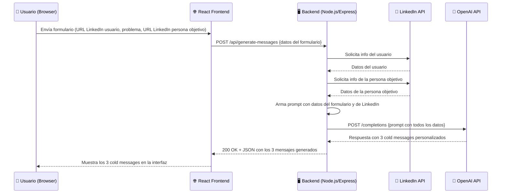
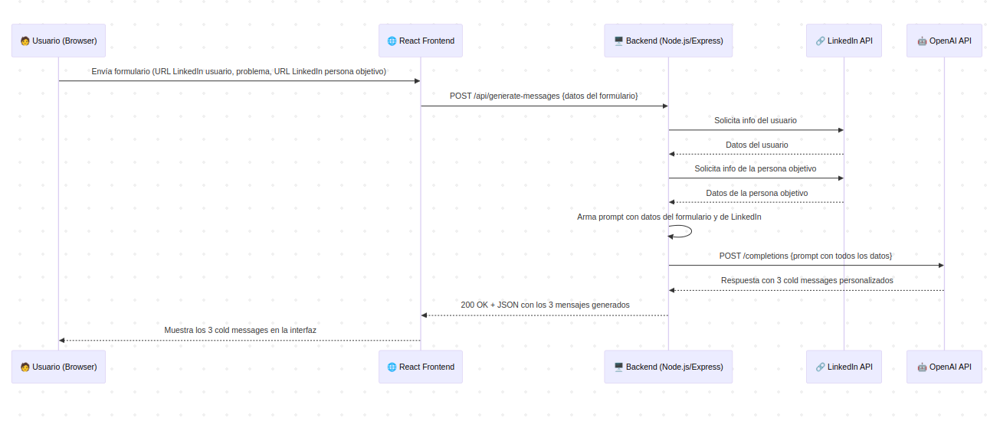

# Descripción high level del proyecto

Esta es una fullstack application cuyo objetivo es crear [cold messages](https://www.google.com/search?q=cold+message+meaning&sca_esv=b02fb6a0238aa473&ei=KuoTaJv6D9aM5OUPhZ7HuAw&ved=0ahUKEwibt83-nYONAxVWBrkGHQXPEccQ4dUDCBI&uact=5&oq=cold+message+meaning&gs_lp=Egxnd3Mtd2l6LXNlcnAiFGNvbGQgbWVzc2FnZSBtZWFuaW5nMgUQABiABDIGEAAYFhgeMggQABgWGAoYHjIGEAAYFhgeMgYQABgWGB4yCxAAGIAEGIYDGIoFMgsQABiABBiGAxiKBTIFEAAY7wUyCBAAGIAEGKIEMggQABiABBiiBEjnB1DrAliHB3ACeAGQAQCYAW-gAfIEqgEDMi40uAEDyAEA-AEBmAIIoAKPBcICChAAGLADGNYEGEeYAwCIBgGQBgiSBwMyLjagB8QosgcDMC42uAeGBQ&sclient=gws-wiz-serp) personalizados para mandarle a un perfil de linkedin teniendo en cuenta tu objetivo específico a cumplir

Lo que hace es generar mensajes tipo _icebreaker_ para enviar a nuevas conexiones en LinkedIn. Los mensajes que se crean son para abrir una conversación, sonar humanos, naturales y alinearse con el estilo de escritura del usuario.

La aplicación genera tres opciones de mensajes tipo _icebreaker_ para enviar a un perfil de LinkedIn, teniendo en cuenta el objetivo específico que se quiere cumplir con cada mensaje. Para ello, la aplicación usa información sobre el perfil del usuario que envía el mensaje (emisor), el problema que resuelve y la solución que ofrece, además de CUALQUIER información útil del perfil del destinatario del mensaje.

**Input**:

- url de perfil de linkedin de quien manda el mensaje (para obtener información personal y estilo de escritura del usuario emisor)
- información respecto a que problema resolvés
- información respecto a que solución ofreces
- url de perfil linkedin a quien mandarle el mensaje

**output**:

- 3 opciones de _icebreaker_ personalizadas. Cada opción debe ser breve, directa, y facilitar una respuesta humana.

# User Stories con definition of done

### Contexto de la aplicación

**Como** usuario nuevo, **quiero** que la aplicación me explique qué es y cómo funciona para poder entender su propósito y cómo utilizarla.

Definition of Done:

- La aplicación muestra un mensaje de bienvenida claro y conciso al usuario.
- La aplicación proporciona una breve descripción de su funcionalidad y propósito.

### Ejemplos de mensajes generados

**Como** usuario nuevo, **quiero** ver ejemplos de mensajes generados para entender cómo funciona la aplicación y qué tipo de mensajes puedo esperar.

Definition of Done:

- La aplicación muestra ejemplos de mensajes generados en la página de inicio.
- Los ejemplos son variados y representan diferentes estilos de escritura y enfoques.
- Los ejemplos son relevantes y útiles para el usuario.

### LLamada a la acción

**Como** aplicación, **quiero** hacer que el usuario se sienta motivado a probar la aplicación para que pueda experimentar su funcionalidad y beneficios.

Definition of Done:

- La aplicación muestra un mensaje como "Pruébalo ahora mismo. ¡Las primeras 3 generaciones son gratis!"
- La aplicación muestra un contador que va aumentando indicando todas la generaciones que se han hecho en la aplicación. Y que se siguen haciendo en "tiempo real".
- La aplicación hace alguna aniamación o efecto visual que llame la atención del usuario sobre el contador y la llamada a la acción.

### Generación de mensajes tipo _icebreaker_

**Como** usuario, **quiero** ingresar la información minima necesaria para generar mensajes personalizados que me permitan abrir una conversación en LinkedIn.

Definition of Done:

- La aplicación permite al usuario ingresar la URL de su perfil de LinkedIn.
- La aplicación permite al usuario ingresar información sobre el problema que resuelve y la solución que ofrece.
- La aplicación permite al usuario ingresar la URL del perfil de LinkedIn del destinatario.
- La aplicación permite hacer la solicitud de generación de mensajes.
- La aplicación maneja de una forma amigable el estado de carga mientras se generan los mensajes.
- La aplicación muestra un mensaje claro y conciso al usuario una vez que se generan los mensajes.
- La aplicación muestra los mensajes generados de forma clara y fácil de leer.
- La aplicación muestra junto con los mensajes generados el resumen de la información ingresada por el usuario.

### Copiar mensajes generados

**Como** usuario, **quiero** poder copiar los mensajes generados para poder usarlos fácilmente en LinkedIn.

Definition of Done:

- La aplicación permite al usuario copiar los mensajes generados con un solo clic.

### Instrucciones sobre los mensajes generados

**Como** usuario, **quiero** recibir instrucciones sobre cómo usar los mensajes generados para maximizar su efectividad.

Definition of Done:

- La aplicación proporciona instrucciones claras y concisas sobre cómo usar los mensajes generados.
- Las instrucciones son relevantes y útiles para el usuario.

# Link a v0

- Segunda version (Version final)

  https://v0.dev/chat/icebreaker-IgiyP5RY7pp

- Primera version

  https://v0.dev/chat/iLosFQCEOcx

  Este chat en v0.dev se creó dentro del contexto de un proyecto donde se agrego la descripción y un contexto:

### Descripción

```
El objetivo de esta aplicación es generar mensajes personalizados, conocidos como cold messages, para enviar a nuevos contactos en LinkedIn. Estos mensajes deben abrir conversaciones de manera natural, alineados con el estilo de escritura del usuario, y deben ser adecuados para el perfil al que se envían.
```

### Contexto

```
Una fullstack application cuyo objetivo sea crear *cold messages* personalizados para mandarle a un perfil de linkedin teniendo en cuenta tu objetivo específico a cumplir

La idea es generar mensajes tipo *icebreaker* para enviar a nuevas conexiones en LinkedIn. Los mensajes deben abrir una conversación, sonar humanos, naturales y alinearse con el estilo de escritura del usuario.

La aplicación debe generar tres opciones de mensajes tipo *icebreaker* para enviar a un perfil de LinkedIn, teniendo en cuenta el objetivo específico que se quiere cumplir con cada mensaje. Para ello, la aplicación utilizará información sobre el perfil del usuario que envía el mensaje (emisor), el problema que resuelve y la solución que ofrece, además de CUALQUIER información útil del perfil del destinatario del mensaje.

**Input**:

- url de perfil de linkedin de quien manda el mensaje (para obtener información personal y estilo de escritura del usuario emisor)
- información respecto a que problema resolvés
- información respecto a que solución ofreces
- url de perfil linkedin a quien mandarle el mensaje

**output**:

- 3 opciones de *icebreaker* personalizadas. Cada opción debe ser breve, directa, y facilitar una respuesta humana.
```

# External dependencies

### OpenAI API

- Esta aplicación utiliza la API de OpenAI para generar los mensajes personalizados. La API se encarga de procesar toda la información que la aplicación recolecta a partir de la información ingresada por el usuario y devolver las opciones de mensajes generados.

### Api de LinkedIn

- Esta aplicación utiliza la API [Real-Time LinkedIn Scraper API](https://rapidapi.com/rockapis-rockapis-default/api/linkedin-data-api) para obtener información del perfil de LinkedIn del usuario emisor y del destinatario. Esta API permite acceder a datos públicos de los perfiles de LinkedIn, como nombre, ocupacion, experiencia laboral, educación, publicaciones, reacciones a publicaciones, etc. Lo que permite personalizar los mensajes generados.

# Costos

### Resumen de costos

- **Costo de la API de OpenAI**: $0.0208 por cada request de usuario

- **Costo de la API de LinkedIn**: $0.021 por cada request de usuario

- **Costo total por cada request de usuario**: $0.0418

### Costos de la API de OpenAI

Se decidió utilizar el modelo
[gpt-4.1-mini](https://platform.openai.com/docs/models/gpt-4.1-mini) de OpenAI para la generación de mensajes. Por ser uno modelo que tiene un balance entre inteligencia, velocidad y costo.

OpenAI calcula el coste de uso de un modelo por 3 factores:

1. **Input (Tokens de entrada sin caché):**

   - Son los tokens nuevos que el modelo procesa por primera vez.
   - Se facturan al precio estándar por millón de tokens.

2. **Cached Input (Tokens de entrada en caché):**

   - Corresponden a partes del prompt que el modelo ya ha procesado recientemente y que están almacenadas en caché.
   - Se facturan a un precio reducido, generalmente con un descuento del 50% respecto al costo estándar de los tokens de entrada .

3. **Output (Tokens de salida):**

   - Son los tokens generados por el modelo como respuesta al prompt.
   - Se facturan al precio estándar por millón de tokens de salida.

Para el modelo gpt-4.1-mini, el costo por millón de tokens seria la suma de $0.40 (input), $0.10 (cache input), $1.60 (output) = $2.10 por millón de tokens o $0.0021 por token cada 1k tokens.

Por pruebas realizadas se podria estimar que la generacion de cada mensaje consume de forma segmentada:

- unos 50k tokens de input (0.02$)
- no tenemos informacion del cache pero se va a poner en 0, porque no se hacen requests sobre el mismo hilo.
- unos 500 tokens de output (0.0008$)

En total el calculo del costo por cada 3 mensajes generados seria: 0.0208$

### Costos de la API de LinkedIn

El uso de la API de linkedin es por planes, cada plan te da X cantidad de creditos y cada request que se hace a la API suele ser un credito.

Los planes son los siguientes:

- Plan gratuito 50 creditos, cuesta 0 dolares
- Plan PRO 50k creditos, cuesta 175 dolares
- Plan ultra 100k creditos, cuesta 300 dolares
- Plan Mega 200K creditos, cuesta 500 dolares

Cada generación de mensajes consume 6 creditos, ya que se hace una request a la API de linkedin para obtener:

1. Información del perfil del emisor
2. Información del perfil del destinatario
3. Publicaciones del emisor
4. Publicaciones del destinatario
5. Comentarios del emisor sobre publicaciones de terceros
6. Reacciones del destinatarios sobre publicaciones de terceros

Asi que segun el plan contratado el costo por cada generación de mensajes seria:

- Plan gratuito: 0$
- Plan PRO: 0.021$
- Plan ultra: 0.018$
- Plan Mega: 0.015$

# Arquitectura de datos

### Modelo de datos

En el codigo de la aplicación, en la ruta `server/src/domain` esta de foma mas detallada el modelo de datos que representa a las reglas de negocio de la aplicación. A continuación se describen las entidades relevantes para el funcionamiento de la aplicación:

```typescript
interface IcebreakerMessagesRequest {
  senderProfileUrl: string; // URL del perfil de LinkedIn del emisor
  problemDescription string; // Descripción del problema que resuelve
  solutionDescription: string; // Descripción de la solución que ofrece
  recipientProfileUrl: string; // URL del perfil de LinkedIn del destinatario
}

interface MessageTemplate {
  id: number;           // ID único del mensaje
  instruction: string;  // Instrucción de ejemplo para el modelo
  title: string;        // Título del mensaje
  category: string;     // Categoría del mensaje
  example: string;      // Ejemplo de mensaje
}

interface Profile {
  id: number;           // ID único del perfil
  username: string;     // Nombre de usuario del perfil
  firstName: string;    // Primer nombre del usuario
  lastName: string;     // Apellido del usuario
  profilePicture: string; // URL de la foto de perfil
  headline: string;     // Descripción profesional del usuario
  summary: string;      // Auto descripción del usuario en el ambito laboral
  certifications: {     // Certificiones/cursos que el usuario ha realizado
      year: number;
      name: string;
      institution: string;
  }[];
  lastPosition: {       // Última posición laboral del usuario
      title: string
      companyName: string
      startYear: number
      startMonth: number
    } | null
}

interface Post {
  id: number;                 // ID único de la publicación
  postedContent: string;      // Contenido textual de la publicación
  publicationUrl: string;     // URL de la publicación
  postedDate: string;         // Fecha de publicación
  authorUsername: string;     // Nombre de usuario del autor
  hasMediaContent: boolean;   // Indica si la publicación tiene contenido multimedia
}

interface SenderComment {
  id: number;                 // ID único del comentario
  authorUsername: string;     // Nombre de usuario del autor
  commentedContent: string;   // Contenido del comentario
  commentedInPublicationUrl: string; // URL de la publicación en la que se comentó
  commentDate: string;        // Fecha del comentario
}

```

# API Reference

### Contexto

Para esta aplicación se desarrolló una API RESTful con express y typescript. Pero la logica de negocio se desacopló de la implementacion (API REST), asi que se creo una aplicacion de servidor tipo core con una arquitectura clean que define un dominio para la logica de negocio `server/src/domain` y define cada accion sobre la aplicacion, como la accion de generar mensajes, como features (`/server/src/features`). En este caso solo fue necesario desarrollar el feature de generar mensajes (`server/src/features/icebreaker-messages-request`).

La importancia de esta arquitectura radica en dos aspectos fundamentales:

1. La aplicacion express que se monto es basica y no soportar una carga alta de usuarios. Por lo que cuando sea necesario responder a mayor demanda seria muy facil hacer una implementacion del mismo servidor usando otras tecnologias que soporten una carga mayor de usuarios.

2. Agregar otras acciones o features sobre la aplicacion, como por ejemplo la de guardar los mensajes generados en una base de datos, o la de enviar los mensajes generados a un servicio de mensajeria, o la de enviar los mensajes generados por email. Todo esto se puede hacer sin modificar la logica de negocio actual y/o si es necesario modificarla, la arquitectura permite hacerlo de una forma sencilla y controlada.

> Nota Importante: La arquitectura implementada podria mejorarse en diferentes aspectos, por ejemplo, que este tipo de desarrollos tenga pruebas unitarias sobre lo logica de negocio y sobre los casos de uso dentro de los features: Mitiga mas del 90% de los errores que se pueden tener en la aplicacion. En este caso no se hicieron pruebas unitarias por falta de tiempo y por darle prioridad a otras cosas en el contexto de la prueba tecnica. Pero es importante tenerlo en cuenta para el futuro.

### Rutas relevantes creadas

- `POST /api/icebreaker-messages`: Genera mensajes tipo _icebreaker_ personalizados para enviar a un perfil de LinkedIn.

  - **Request Body**:
    ```json
    {
      "senderUrl": "https://www.linkedin.com/in/ejemplo",
      "problemDescription": "Descripción del problema que resuelve",
      "solutionDescription": "Descripción de la solución que ofrece",
      "receiverUrl": "https://www.linkedin.com/in/ejemplo"
    }
    ```
  - **Response on success**:

    ````json
    {
      "status": "success",
      "data": [
        {
          {
            "message": "Hola [Nombre del destinatario], coincidimos en la importancia de construir culturas centradas en las personas y basadas en datos. En [Nombre de tu empresa] ayudamos a optimizar procesos de [Área de especialización] con [Descripción breve de tu solución], ¿te interesaría explorar cómo podemos potenciar tus estrategias?",
            "templateTitle": "Referencia a contacto en común",
            "templateCategory": "Conexión",
            "instruction": "Antes de enviar, dale like a su post reciente sobre [Tema relevante] para mostrar interés.",
            "sourcePosts": [
              "https://www.linkedin.com/feed/update/urn:li:activity:[ID_de_la_publicación]/"
            ],
            "receiverName": "[Nombre del destinatario]",
            "receiverProfilePicture": "[URL de la foto de perfil del destinatario]",
            "receiverHeadline": "[Titular profesional del destinatario]",
            "senderName": "[Tu nombre]",
            "senderProfilePicture": "[URL de tu foto de perfil]",
            "senderHeadline": "[Tu titular profesional]"
          },
          {...}
          {...}
          ```
        }
      ]
    }
    ````

  - **Response on success**:
    ```json
    {
      "status": "error",
      "name": "unexpected_error",
      "message": "Error interno del servidor"
    }
    ```

### Rutas de soporte

- `GET /api/health`: Ruta para verificar el estado de la API.

  - **Response**:
    ```json
    { "status": "ok" }
    ```

- `GET /api/linkedin-api`: Ruta para verificar la conexión con la API de LinkedIn.

  - **Request Queries**:
    ```json
    { "url": "https://www.linkedin.com/in/ejemplo", "type": "profile" }
    ```
  - **Response**:
    responde el json completo del perfil de linkedin ver `ProfileDataResponse` en `/workspaces/linkedin-icebreaker-messages/server/src/services/linkedin-api/types/profile-data.ts`

- `GET /api/openai-api`: Ruta para verificar la conexión con la API de OpenAI.

  - **Request Queries**:

    ```
    prompt: "Hola  esto es solo una prueba de conexion por tercera vez"
    ```

  - **Response**:
    ```json
    {
      "status": "success",
      "data": "{\n  \"mensaje\": \"Hola, tu prueba de conexión ha sido recibida correctamente por tercera vez.\"\n}"
    }
    ```

# High level sequence diagrams





# Error handling (handling and user feedback)

Para manejar los errores se decidió enviar desde el servidor nombres de errores que especifican el tipo de error que ocurrió. Para que la aplicación cliente pueda manejarlo de forma adecuada y mostrar un mensaje al usuario que le permita entender que fue lo que ocurrió.

Los errores que se manejan son los siguientes:

  - `bad_request`: Error de validación de los datos ingresados por el usuario. Se devuelve cuando la request no cumple con el formato esperado o faltan datos obligatorios.
  
  - `sender_profile`: Error al obtener el perfil del emisor. Se devuelve cuando no se puede obtener la información del perfil de LinkedIn del emisor desde la API de LinkedIn.
  
  - `receiver_profile`: Error al obtener el perfil del destinatario. Se devuelve cuando no se puede obtener la información del perfil de LinkedIn del destinatario desde la API de LinkedIn.
  
  - `sender_posts`: Error al obtener las publicaciones del emisor. Se devuelve cuando no se puede obtener la información de las publicaciones del emisor desde la API de LinkedIn.
  
  - `receiver_posts`: Error al obtener las publicaciones del destinatario. Se devuelve cuando no se puede obtener la información de las publicaciones del destinatario desde la API de LinkedIn.
  
  
  - `sender_comments`: Error al obtener los comentarios del emisor. Se devuelve cuando no se puede obtener la información de los comentarios del emisor desde la API de LinkedIn.
  
  - `receiver_reactions`: Error al obtener las reacciones del destinatario. Se devuelve cuando no se puede obtener la información de las reacciones del destinatario desde la API de LinkedIn.
  
  - `messages_template`: Error al obtener la plantilla de mensajes. Se devuelve cuando no se puede obtener la información de la plantilla de mensajes desde la API de OpenAI.
  
  - `ai_response`: Error al obtener la respuesta de la API de OpenAI. Se devuelve cuando no se puede obtener la información de la respuesta de la API de OpenAI.
  
  - `linkedin_api_rate_limit`: Error de límite de tasa de la API de LinkedIn. Se devuelve cuando se supera el límite de solicitudes a la API de LinkedIn.

  - `unexpected_error`: Error inesperado. Se devuelve cuando ocurre un error no manejado en el servidor.


# Non functional requirements (rate limiting, platform limits, etc)

## Requisitos No Funcionales

### Limitaciones de API

- **OpenAI API**: 
  - Tiene una estrcutura de costos que que es importante considerar en el presupuesto operativo
  - En mi experiencia con la API de OpenAI, sé que cuando se hacen muchas consultas en paralelo con el mismo token, te bloquean las requests. Por lo que es importante implementar un sistema de rate limiting para evitar bloqueos. Si la aplicación tiene un alto volumen de usuarios.

- **LinkedIn API**:
  - Tiene limitaciones por cada plan de pago, lo que puede afectar la cantidad de consultas que se pueden realizar. Hay qu estudiar el plan adecuado según el volumen de uso esperado.
  - Entre las pruebas que se estuvieron haciendo, se notó inestabilidad en las consultas, en algunos momentos para un perfil que ya se habia obtenido una respuesta anteriormente, daba error de que el request no se pudo completar. Esto puede ser un problema si la inestabilidad se mantiene constante y abria que buscar una solución alternativa. Considerando otra API, por ejemplo.

### Consideraciones Adicionales

- **Manejo de Errores**: Desarrollar estrategias robustas para situaciones de fallo en las consultas a LinkedIn
- **Escalabilidad**: Prever el crecimiento en uso y cómo afectará los costos y límites de las APIs
- **Optimización de Recursos**: Minimizar el número de requests necesarios para reducir costos. Ahora mismo se realizan 6 requests por cada generación de mensajes. Seria necesario hacer pruebas sobre los resultados a partir de pasarle menos datos a la API de OpenAI. Por ejemplo, no pasarle los posts y comentarios del emisor y del destinatario. Y ver si el resultado es el mismo o similar.
- **Tiempo de Respuesta**: Gestionar las expectativas del usuario durante los procesos de consulta y generación
- **Tolerancia a Fallos**: Implementar mecanismos de resilencia para mantener la funcionalidad ante fallos de las APIs externas

Estos requisitos no funcionales son críticos para garantizar la operatividad continua y experiencia de usuario positiva, considerando las dependencias externas del sistema.

# Rollout (feature flags, straight to prod, etc)

En el caso de llevar esta aplicación a producción yo lo haria a traves de un proceso de despligue continuo (CI/CD) usando un pipeline de despliegue automatizado.

Como parte de ese pipeline seria necesario agregar pruebas unitarias sobre la logica de negocio y sobre los casos de uso dentro de los features. Mitigando asi mas del 90% de los errores (en mi experiencia) que se pueden tener en produccion.

Dichos test se correrian como parte del pipeline de despliegue y si alguno de los test falla, el pipeline no se ejecuta y no se hace el despligue a produccion.

El despligue seria directo a produccion, ya que la aplicacion no tiene una alta carga de usuarios y no tiene sentido hablar de despligues graduales, con feature flags.

Pero como lo estuve comentando con @Luciano, esta aplicacion hace uso de APIs externas como la de OpenAI que se paga por uso. Por lo que si la aplicacion tiene un alto volumen de usuarios o si por alguna razon nuestro servidor es atacado de forma malisiosa, se pueden generar costos inesperados. Por lo que seria importante implementar un sistema de que limite los requests que puede procesar nuestro servidor en X cantidad de request cada 1 hora, por ejemplo. Y que cuando se supere ese limite, la aplicacion comience a poner a los usuarios que sigan haciendo requests en una cola de espera que se vaya resolviendo a medida que se vayan liberando los slots de requests. Esto es algo que no se implemento en esta version, pero es importante tenerlo en cuenta para llevarlo a produccion.

Hacer un despligue directo a produccion con un pipeline nos permite hacer cambios que se requiran de forma rapida y tenerlos produccion en unos pocos minutos.

# Product analytics (eventos y que gráficos vamos a tener)

Basándome en el proyecto de generación de mensajes para LinkedIn, aquí está mi propuesta de product analytics. 

Para generar esta propuesta, me ayudé de un modelo de lenguaje de IA para organizar las ideas principales que tenia que basicamente eran los KPIs que se especifican al final de la sección. Asi que con el LLM supe que eran necesarios captar y procesar todos los eventos que especifico a continuación. Y cuales eran los graficos y dashboards que nos pueden ayudar a visualizar y hacer seguimientos a esos KPIs.

# Product Analytics: Eventos y Gráficos

## Eventos a Trackear

### Eventos de Adquisición
- **Primera Visita**: Registrar fuentes de tráfico y canales de adquisición
- **Visualización de Ejemplos**: Cuántos usuarios ven los ejemplos de mensajes
- **Interacción con CTA**: Clics en "Pruébalo ahora mismo"
- **Reacción al Contador**: Interacciones con el contador de generaciones

### Eventos de Activación
- **Inicio de Formulario**: Usuario comienza a completar datos
- **Formulario Parcial**: Usuario completa algunos campos pero no todos
- **Formulario Completo**: Usuario completa todos los campos necesarios
- **Solicitud de Generación**: Usuario solicita la generación de mensajes

### Eventos de Retención
- **Generaciones Completadas**: Cantidad de generaciones exitosas
- **Copias de Mensajes**: Cuántas veces se copian los mensajes generados
- **Mensajes por Sesión**: Promedio de mensajes generados por sesión
- **Retorno de Usuario**: Usuarios que vuelven a generar mensajes

### Eventos de Calidad
- **Tiempo de Generación**: Duración del proceso de generación
- **Errores en Generación**: Fallos durante el proceso
- **Abandono durante Carga**: Usuarios que salen durante la generación

## Gráficos y Dashboards

### Dashboard Principal
1. **Embudo de Conversión**
   - Visualización del recorrido: Visita → Ver ejemplos → Iniciar formulario → Completar generación → Copiar mensaje

2. **Contador de Generaciones**
   - Gráfico en tiempo real del total de mensajes generados
   - Tendencia diaria/semanal/mensual

3. **Mapa de Calor de Formulario**
   - Visualización de campos más completados vs abandonados

### Dashboard de Comportamiento
1. **Distribución de Mensajes Copiados**
   - Porcentaje de usuarios que copian 1, 2 o los 3 mensajes generados
   - Cuál de las tres opciones es la más copiada

2. **Tiempos de Interacción**
   - Tiempo promedio en completar el formulario
   - Tiempo de espera durante la generación
   - Tiempo de decisión para copiar un mensaje

3. **Patrones de Uso**
   - Horas del día con más generaciones
   - Días de la semana más activos
   - Frecuencia de retorno por usuario

### Dashboard de Rendimiento Técnico
1. **Velocidad de Generación**
   - Tiempo promedio de generación
   - Tendencia de velocidad a lo largo del tiempo

2. **Tasa de Éxito**
   - Porcentaje de generaciones exitosas vs fallidas
   - Tipos de errores más comunes

3. **Carga del Sistema**
   - Correlación entre volumen de solicitudes y tiempos de respuesta

## KPIs Clave

1. **Tasa de Conversión Total**: Visitantes → Generaciones completadas
2. **Tasa de Copias**: Porcentaje de mensajes generados que son copiados
3. **Tiempo Promedio de Generación**: Velocidad del servicio
4. **Retención a 7 días**: Usuarios que vuelven dentro de una semana
5. **Costo por Generación**: Recursos consumidos por cada mensaje generado

Con estos eventos y visualizaciones, podremos optimizar tanto la experiencia del usuario como el rendimiento técnico de la aplicación, mejorando constantemente el servicio basándonos en datos reales de uso.