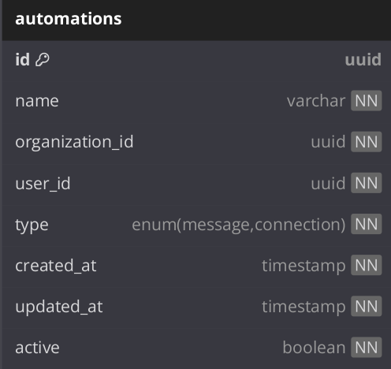
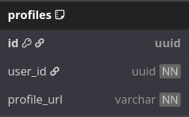
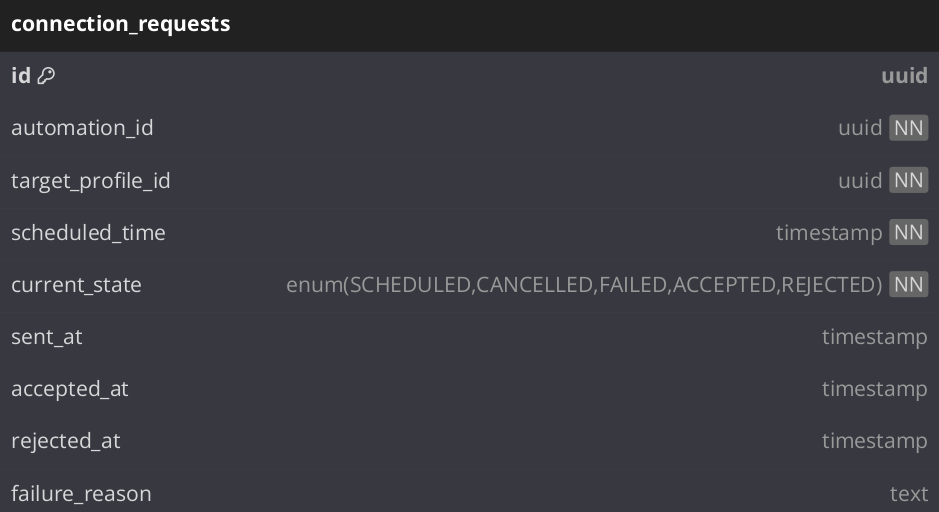
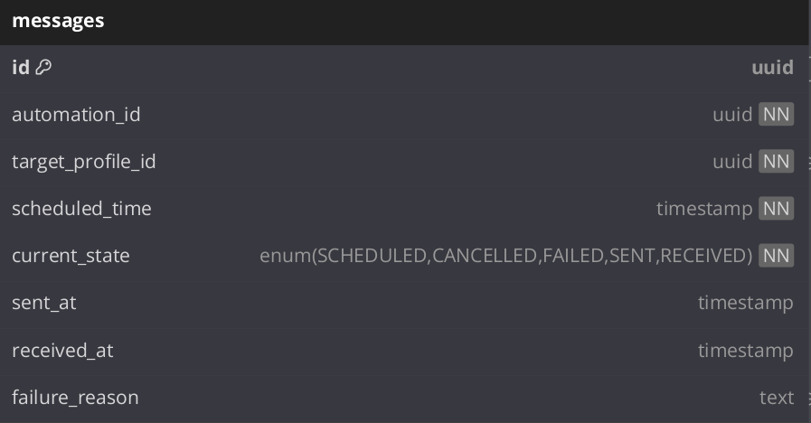
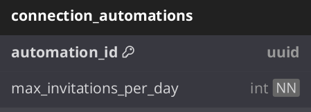
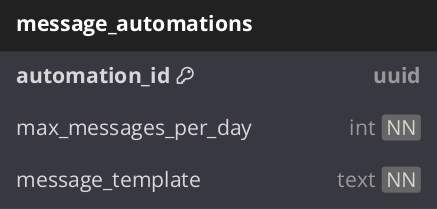
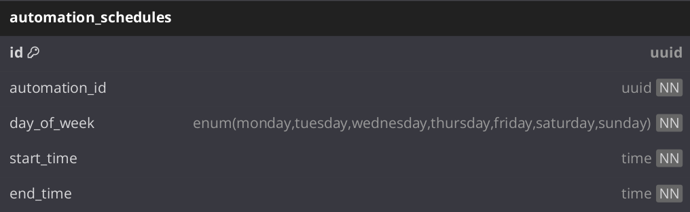
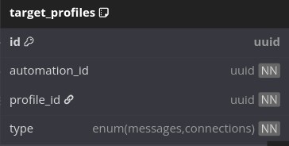
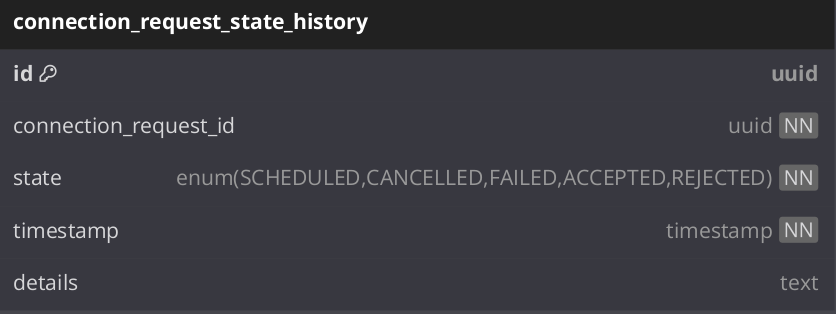
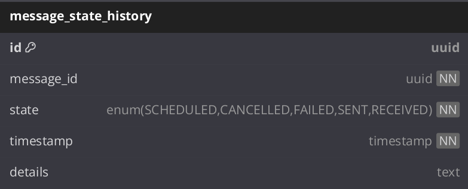

# BD de automatizaciones de LinkedIn

Puede ver el ejercicio original en [exercise-db-linkedin-automations.md](exercise-db-linkedin-automations.md).

Puede ver la solución en formato dbml y online en [dbdiagram.io: db-linkedin-automations.dbml](https://dbdiagram.io/d/DB-de-linkedin-automations-681ff3d95b2fc4582f0dab2e).

> **Nota 1:** Al final se adjunta un diagrama de la base de datos en formato dbml.

> **Nota 2:** También se adjunta el diagrama en un pdf para que sea más fácil de leer.


## Explicación de la solución

#### Entidades teóricas

Se comenzó por definir las entidades teoricas principales del ejercicio, que son:

- **Automation**: Representa una automatización de mensajes o conexiones.
- **Schedule**: Representa la programación de una automatización.
- **Profile**: Representa a un perfil de LinkedIn.
- **Message**: Representa un mensaje enviado a un perfil.
- **Connection**: Representa una invitación a conectar con un perfil.

A partir de estas entidades teoricas, se definieron las tablas y relaciones necesarias para modelar el comportarmiento de las automatizaciones definidas en el ejercicio.

#### Tablas principales

- **automations**: Tabla que contiene datos de una automatización base, tiene las propiedades comunes a todas las automatizaciones. Es extendida por las tablas para las automatizaciones especificas de mensajes y conexiones.

  

  - `id`: Identificador único de la automatización.
  - `name`: Nombre de la automatización.
  - `organization_id`: Identificador de la organización a la que pertenece la automatización.
  - `user_id`: Identificador del usuario que ejecuta la automatización.
  - `type`: Tipo de automatización (mensajes o conexiones).
  - `created_at`: Fecha y hora de creación de la automatización.
  - `updated_at`: Fecha y hora de la última actualización de la automatización.
  - `active`: Indica si la automatización está activa o no.

- **profiles**: Tabla que contiene datos de los perfiles de LinkedIn.

    

  - `id`: Identificador único del perfil.
  - `profile_url`: URL del perfil de LinkedIn.

  **indices**: En el diagrama dbml se especifica que para esta tabla se creen los indices `profile_url` y `user_id`, para optimizar las consultas a la tabla.

- **connections_requests**: Tabla que contiene datos de las invitaciones a conectar.

  

  - `id`: Identificador único de la invitación.
  - `automation_id`: Identificador de la automatización a la que pertenece la invitación.
  - `target_profile_id`: Identificador del perfil al que se va a enviar la invitación.
  - `scheduled_time`: Fecha y hora programada para enviar la invitación.
  `current_state`: Estado actual de la invitación (SCHEDULED, CANCELLED, FAILED, ACCEPTED, REJECTED).

    > Nota: Analizar mejor si es necesario que se pueda establecer el estado `SENT`, ya que cuando se envia una solicitud de conexion no se tendria claro a que estado podria cambiarse.

  **indices**: En el diagrama dbml se especifica que para esta tabla se creen los indices `automation_id`, `target_profile_id` y `current_state` para optimizar la consultas a la tabla.


- **messages**: Tabla que contiene datos de los mensajes enviados.

  

  - `id`: Identificador único del mensaje.
  - `automation_id`: Identificador de la automatización a la que pertenece el mensaje.
  - `target_profile_id`: Identificador del perfil al que se va a enviar el mensaje.
  - `scheduled_time`: Fecha y hora programada para enviar el mensaje.
  - `current_state`: Estado actual del mensaje (SCHEDULED, CANCELLED, FAILED, SENT, RECEIVED).
  - `sent_at`: Fecha y hora en la que se envió el mensaje.
  - `received_at`: Fecha y hora en la que se recibió el mensaje.
  - `failure_reason`: Motivo del fallo al enviar el mensaje.

  **indices**: En el diagrama dbml se especifica que para esta tabla se creen los indices `automation_id`, `target_profile_id` y `current_state` para optimizar la consultas a la tabla.

#### Tablas para automatizaciones especificas.

Ahora mismo en este diseño solo tenemos dos tipos de automatizaciones, pero se puede extender a otros tipos (o variaciones de las actuales) de automatizaciones en el futuro. Por eso se decidio que los datos para cada automatización específica se guarden en tablas separadas, que extienden la tabla base de automatizaciones `automations`. Creando asi un diseño modular y que usa el patrón de herencia para dar soporte a la escalabilidad y la flexibilidad.

- **connection_automations**: Tabla que contiene datos de las automatizaciones de conexiones.

  

  - `automation_id`: Identificador de la automatización a la que pertenece la conexión.
  - `max_connections_per_day`: Número máximo de invitaciones a enviar cada día.

- **message_automations**: Tabla que contiene datos de las automatizaciones de mensajes.

  

  - `automation_id`: Identificador de la automatización a la que pertenece el mensaje.
  - `max_messages_per_day`: Número máximo de mensajes a enviar cada día.
  - `message_template`: Template del mensaje a enviar.


#### Tablas relacionadas a la programación de las automatizaciones

La programación de las automatizaciones se maneja mediante la tabla `automation_schedules`, que contiene los datos de la programación de cada automatización. Esta tabla tiene una relación uno a muchos con la tabla `automations`, ya que cada automatización debe tener una programación asociada por dia, y podrian tener más de una automatización programada para el mismo día pero no pueden solaparse en el tiempo.

  

  - `id`: Identificador único de la programación.
  - `automation_id`: Identificador de la automatización a la que pertenece la programación.
  - `data_of_week`: Dia de la semana en el que se ejecuta la automatización (Lunes, Martes, etc).
  - `start_time`: Hora de inicio de la automatización.
  - `end_time`: Hora de fin de la automatización.

  **indices**: En el diagrama dbml se especifica que para esta tabla se creen los indices `automation_id` y `day_of_week`, para optimizar las consultas a la tabla. Esto es importante ya que la tabla puede crecer mucho en el tiempo, y las consultas a esta tabla son muy frecuentes, ya que cada vez que se ejecuta una automatización se consulta esta tabla para saber si la automatización está programada para ese día y hora. 

Tener una tabla para las programaciones permite consultas eficientes para determinar rápidamente cuándo debe ejecutarse una automatización.

#### Tablas relacionadas a limitar el número de mensajes/invitaciones

En la logica de negocio es importante limitar el número perfiles a los que se pueden enviar mensajes (maximo 500) o invitaciones (maximo 1000), pero un usuario podria tener muchos mas usuarios registrados, por eso la tabla principal `profiles` contiene todos los perfiles de linkedin registrados para un usuario, y la tabla `target_profiles` contiene los perfiles a los que se enviarán mensajes o invitaciones en el contexto de una automatización.

Con esta tabla es posible realizar la limitacion de los perfiles a los que se pueden enviar mensajes o invitaciones, ya sea usando triggers o validaciones en la logica de la applicacion.
 
 
  

  - `id`: Identificador único del perfil objetivo.
  - `profile_id`: Identificador del perfil de LinkedIn.
  - `automation_id`: Identificador de la automatización a la que pertenece el perfil objetivo.
  - `type`: Tipo de automatización (messages o connections).

  **inidces**: En el diagrama dbml se especifica que para esta tabla se creen los indices `profile_id` y `type`, para optimizar las consultas a la tabla. Las consultas a esta tabla van a ser importante para validar si un usuario puede seguir agregando perfiles a la automatización, o si ya se alcanzó el límite de perfiles a los que se pueden enviar mensajes o invitaciones.


#### Tablas relacionadas a llevar el historial de eventos

Para la logica de negocio es importante llevar un historial de los eventos que ocurren en las automatizaciones, como el envio de mensajes o invitaciones, y su estado. Para esto se crearon las tablas `connection_request_state_history` y `message_state_history`, que contienen el historial de las invitaciones enviadas y los mensjaes enviados respectivamente.

Con los datos que se guardan en estas tablas podemos saber para los mensajes:

- Cuando se programó un mensaje.
- Cuando se envió un mensaje.
- Cuando se recibió un mensaje.

Para las invitaciones podemos saber:

- Cuando se programó una invitación.
- Si fue aceptada, rechazada o cancelada, o si falló el envío.

**connection_request_state_history**: Tabla que contiene el historial de las invitaciones enviadas.


  

  - `id`: Identificador único del historial.
  - `connection_request_id`: Identificador de la invitación a la que pertenece el historial.
  - `state`: Estado de la invitación (SCHEDULED, CANCELLED, FAILED, ACCEPTED, REJECTED).
  - `timestamp`: Fecha y hora en la que se registró el estado.
  - `details`: Detalles adicionales del estado (por ejemplo, motivo del fallo).


**message_state_history**: Tabla que contiene el historial de los mensajes enviados.

  

  - `id`: Identificador único del historial.
  - `message_id`: Identificador del mensaje al que pertenece el historial.
  - `state`: Estado del mensaje (SCHEDULED, CANCELLED, FAILED, SENT, RECEIVED).
  - `timestamp`: Fecha y hora en la que se registró el estado.
  - `details`: Detalles adicionales del estado (por ejemplo, motivo del fallo).


## Resumen de las consideraciones que se tuvieron en cuenta

#### Para la escalabilidad y la flexibilidad

- Se aplicó normalización a las tablas para evitar la duplicación de datos. Pero en algunos casos se optó por desnormalizar algunas tablas para mejorar el rendimiento de las consultas. Por ejemplo, en la tabla `target_profiles` se guardan el tipo de automatizacion (messages o connections) para evitar tener que hacer una consulta adicional a la tabla `automations` para saber el tipo de automatización y poder calcular si una automatización ya alcanzo el limite de perfiles a los que se pueden enviar mensajes o invitaciones.

- Separé claramente las automatizaciones en tablas comunes y específicas para facilitar la expansión a futuros tipos de automatizaciones sin modificar la estructura principal.

- Implementé un patrón de herencia de tablas donde automations contiene los campos comunes y las tablas específicas (message_automations y connection_automations) contienen los campos particulares.

### Diseño en base a tipo de consultas y rendimiento

- Propuse indices en las las columnas de las tablas que se usan con más frecuencia en las consultas, como `automation_id`, `target_profile_id` y `current_state`, para optimizar el rendimiento de las consultas.

- La tabla `automation_schedules` esta pensada para consultas eficientes para determinar rápidamente cuándo debe ejecutarse una automatización.

- Diseñé tablas separadas para los mensajes e invitaciones, cada una con su propio historial de estados, lo que facilita consultas rápidas sobre el estado actual o histórico.

## Diagrama dbml

```dbml
// Use DBML to define your database structure
// Docs: https://dbml.dbdiagram.io/docs

// Tabla principal de automatizaciones (común para todos los tipos)
Table automations {
  id uuid [pk]
  name varchar [not null]
  organization_id uuid [not null]
  user_id uuid [not null]
  type enum('message', 'connection') [not null]
  created_at timestamp [not null, default: `now()`]
  updated_at timestamp [not null, default: `now()`]
  active boolean [not null, default: true]
}

// Automatizaciones específicas de tipo mensaje
Table message_automations {
  automation_id uuid [pk, ref: - automations.id]
  max_messages_per_day int [not null]
  message_template text [not null]
}

// Automatizaciones específicas de tipo conexión
Table connection_automations {
  automation_id uuid [pk, ref: - automations.id]
  max_invitations_per_day int [not null]
}

// Horarios de ejecución de las automatizaciones
Table automation_schedules {
  id uuid [pk]
  automation_id uuid [not null, ref: < automations.id]
  day_of_week enum('monday', 'tuesday', 'wednesday', 'thursday', 'friday', 'saturday', 'sunday') [not null]
  start_time time [not null]
  end_time time [not null]
  
  indexes {
    (automation_id, day_of_week) [unique]
  }

  note: 'limit: no overlapping programming on the same automation. Must be enforced via trigger or application logic.'
}

// Perfiles objetivo para las automatizaciones
Table profiles {
  id uuid [pk]
  user_id uuid [not null, ref: > automations.user_id]
  profile_url varchar [not null]

  indexes {
    (user_id, profile_url) [unique]
  }
}

Table target_profiles {
  id uuid [pk]
  automation_id uuid [not null, ref: < automations.id]
  profile_id uuid [not null, ref: > profiles.id]
  type enum('messages', 'connections') [not null]
  
  indexes {
    (profile_id, type) [unique]
  }
  Note: "Limit: Maximum 500 rows per automation_id and type = 'messages', Maximum 1000 rows per automation_id and type = 'connections'. Must be enforced via trigger or application logic."
}


// Mensajes enviados y su historial de estados
Table messages {
  id uuid [pk]
  automation_id uuid [not null, ref: < automations.id]
  target_profile_id uuid [not null, ref: - target_profiles.id]
  scheduled_time timestamp [not null]
  current_state enum('SCHEDULED', 'CANCELLED', 'FAILED', 'SENT', 'RECEIVED') [not null, default: 'SCHEDULED']
  sent_at timestamp
  received_at timestamp
  failure_reason text
  
  indexes {
    automation_id
    target_profile_id
    current_state
  }
}

// Solicitudes de conexión enviadas y su historial de estados
Table connection_requests {
  id uuid [pk]
  automation_id uuid [not null, ref: < automations.id]
  target_profile_id uuid [not null, ref: - target_profiles.id]
  scheduled_time timestamp [not null]
  current_state enum('SCHEDULED', 'CANCELLED', 'FAILED', 'ACCEPTED', 'REJECTED') [not null, default: 'SCHEDULED']
  sent_at timestamp
  accepted_at timestamp
  rejected_at timestamp
  failure_reason text
  
  indexes {
    automation_id
    target_profile_id
    current_state
  }
}

// Historial de estados de los mensajes
Table message_state_history {
  id uuid [pk]
  message_id uuid [not null, ref: > messages.id]
  state enum('SCHEDULED', 'CANCELLED', 'FAILED', 'SENT', 'RECEIVED') [not null]
  timestamp timestamp [not null, default: `now()`]
  details text
}

// Historial de estados de las solicitudes de conexión
Table connection_request_state_history {
  id uuid [pk]
  connection_request_id uuid [not null, ref: > connection_requests.id]
  state enum('SCHEDULED', 'CANCELLED', 'FAILED', 'ACCEPTED', 'REJECTED') [not null]
  timestamp timestamp [not null, default: `now()`]
  details text
}

```

## Diagrama en pdf


